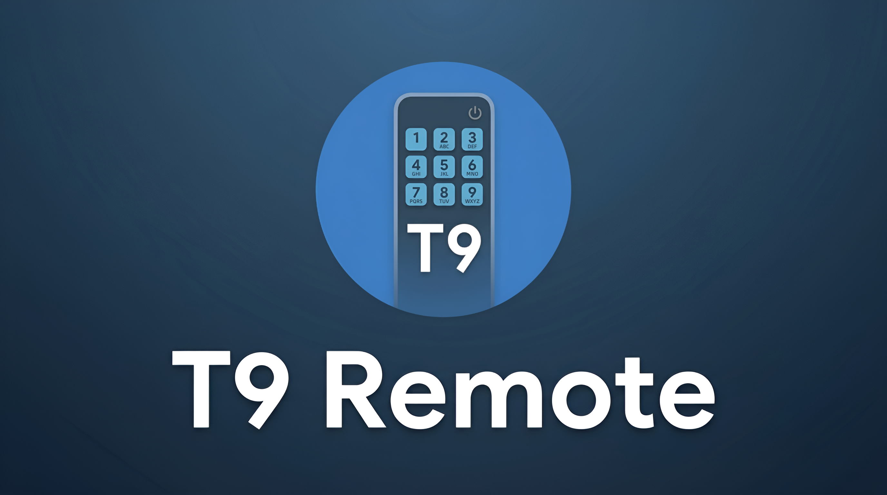
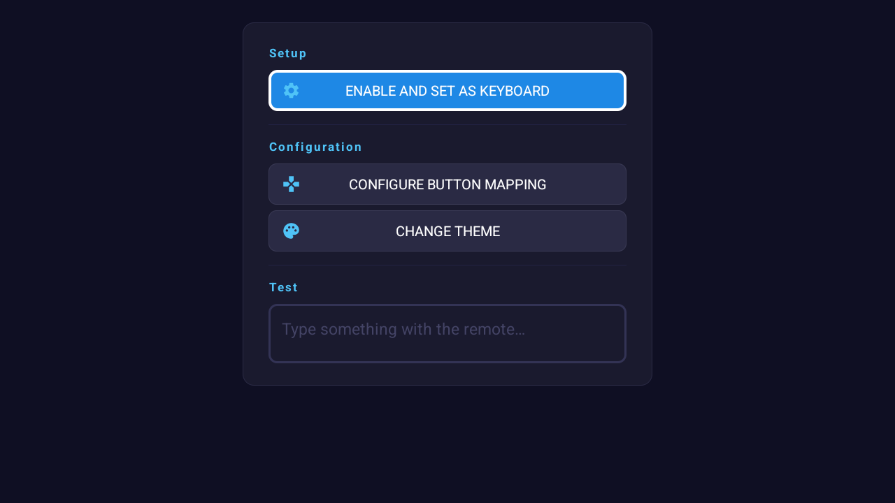
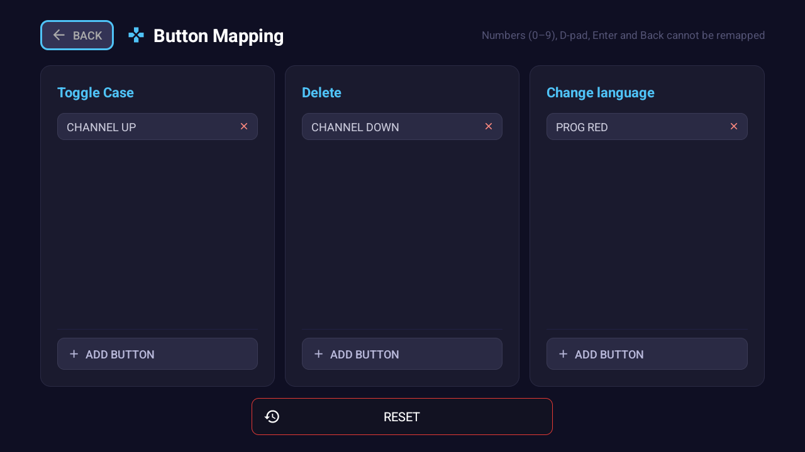
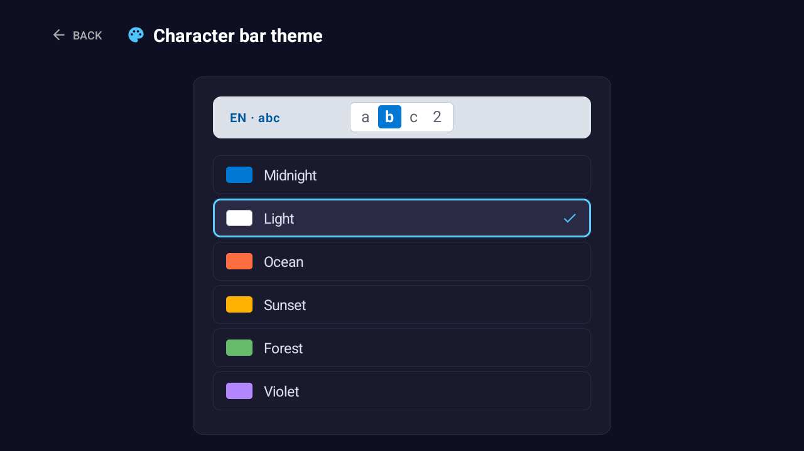
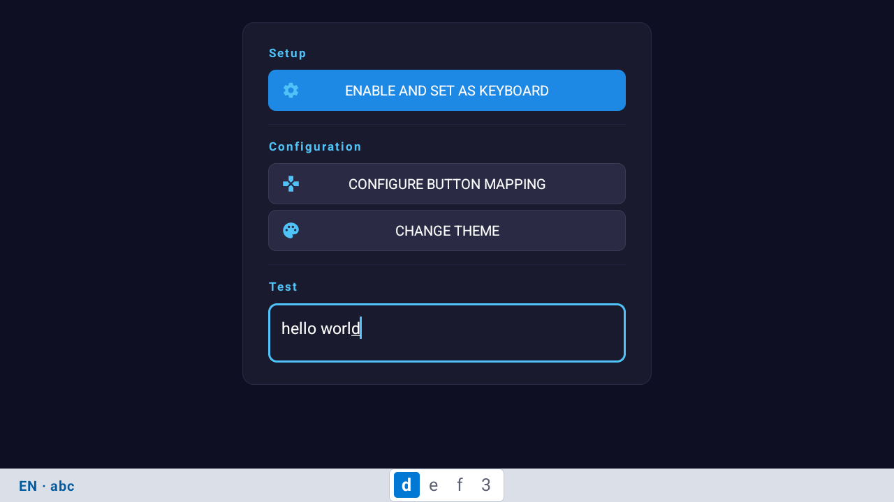

# T9 Remote
📺 A T9-style keyboard app for Android TV that lets you type using the number buttons on your TV remote control — just like old cell phones.

## Features

- **T9 input** using number keys (0–9) on any TV remote
- **English and Spanish** with instant switching
- **Accented characters** (á, é, í, ó, ú, ñ) via long press in Spanish mode
- **Customizable key mapping** — assign any remote button to toggle case, delete, or change language
- **6 visual themes** for the character bar
- **Full capture mode** via adb command — detect even special remote buttons (Netflix, Prime Video, Assistant, etc.)

## Screenshots

